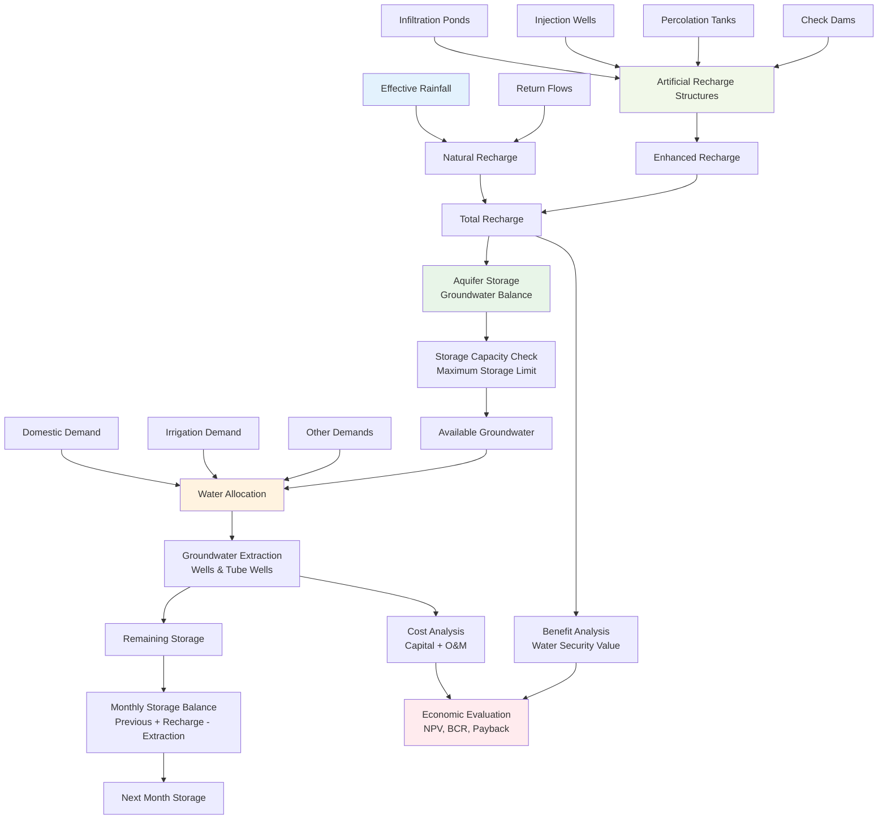

# Aquifer Storage Bucket

The Aquifer Storage Bucket module manages groundwater storage, recharge, and extraction processes within the three-bucket water balance system.

## Overview

This module handles the subsurface water dynamics, including:

- **Groundwater recharge** from infiltration and artificial sources
- **Aquifer storage capacity** management and tracking
- **Water extraction** for domestic and irrigation demands
- **Storage optimization** for drought resilience

## Aquifer Storage Bucket Flow

The aquifer storage bucket implements comprehensive groundwater management:



## Module Structure

### Influx Components

**Water inputs to the aquifer:**

- **`recharge_calculations.py`** - Natural groundwater recharge calculations from soil moisture surplus
- **`recharge_capacity.py`** - Artificial recharge capacity from interventions like injection wells and infiltration ponds

### Outflux Components

**Water outputs from the aquifer:**

- **`domestic_demand.py`** - Domestic water demand calculations and groundwater extraction requirements

### Processing Components

**Core aquifer management:**

- **`storage_tracking.py`** - Real-time monitoring and tracking of aquifer storage levels
- **`storage_capacity.py`** - Maximum storage capacity calculations based on aquifer properties

## Technical Implementation

### Water Balance Equation

The aquifer storage follows the water balance principle:

```
AQ(t) = AQ(t-1) + GWNR(t) + INSW(t) + GWAR(t) - IGW(t-1)
```

Where:
- `AQ(t)` = Aquifer storage at time t
- `GWNR(t)` = Natural groundwater recharge
- `INSW(t)` = Infiltration from surface water storages
- `GWAR(t)` = Artificial groundwater recharge
- `IGW(t-1)` = Irrigation water extracted

### Storage Capacity Calculation

The maximum aquifer storage capacity is calculated using physical parameters:

```python
# storage_capacity.py - Function 001: Calculates aquifer storage limit based on parameters
# Interactions: shared.utilities.to_float
def calculate_storage_limit(aquifer_para_list):
    """Calculate aquifer storage capacity limit"""
    aquifer_depth = to_float(aquifer_para_list[0], 0)
    specific_yield = to_float(aquifer_para_list[2], 0)
    total_area = to_float(aquifer_para_list[3], 0)

    # Storage limit = Depth × Specific Yield × Area × Unit Conversion
    storage_limit = aquifer_depth * (specific_yield / 100) * total_area * 10000
    return storage_limit
```

### Natural Recharge Processing

Groundwater recharge from fallow areas and soil moisture surplus:

```python
# recharge_calculations.py - Function 005: Calculates groundwater natural recharge from fallow land areas
# Interactions: numpy
def calc_gwnr_fallow(smdi_fallow, smdi_shifted_fallow, ae_soil_fallow, pei):
    """Calculate natural groundwater recharge from fallow areas"""
    return abs(smdi_shifted_fallow + ae_soil_fallow - pei) if smdi_fallow == 0 else np.float32(0)

# Process monthly recharge aggregation using pandas
df_crop["GWnr_Fallow"] = df_dd.apply(
    lambda row: calc_gwnr_fallow(
        row["SMDi_Fallow"],
        row["SMDi_shifted_Fallow"],
        row["AE_soil_Fallow"],
        row["Pei"]
    ), axis=1
)
```

### Monthly Aggregation

```python
# recharge_calculations.py - Function 006: Aggregates daily groundwater recharge from fallow areas to monthly totals
# Interactions: pandas
def calc_monthly_gwnrm_fallow(df_crop, df_mm):
    """Aggregate daily recharge values to monthly totals"""
    # Resample the GWnr values to a monthly frequency and sum them
    gw_nrmf = df_crop.resample("M", on="Date")["GWnr_Fallow"].sum().reset_index()
    # Merge the resampled monthly GWnr values into df_mm
    df_mm = df_mm.merge(gw_nrmf, on="Date", how="left")
    return df_mm
```

### Recharge from Precipitation

```python
# recharge_calculations.py - Function 011: Calculates groundwater recharge from precipitation
# Interactions: None
def calc_gw_rech(pi, soil_gwrecharge_coefficient):
    """Calculate groundwater recharge from precipitation"""
    recharge = pi * soil_gwrecharge_coefficient
    return recharge
```

### Added Monthly Recharge from Infiltration

```python
# recharge_calculations.py - Function 012: Calculates added monthly recharge from infiltration
# Interactions: shared.utilities.to_float
def calc_added_monthly_recharge(surface_area, inf_rate):
    """Calculate additional recharge from infiltration structures"""
    inf_rate = to_float(inf_rate, 0)
    return surface_area * inf_rate * 30 / 1000
```

### Final Recharge Calculation

```python
# recharge_calculations.py - Function 015: Calculates final groundwater recharge
# Interactions: pandas
def calc_final_recharge(df_mm):
    """Calculate final groundwater recharge accounting for rejection"""
    df_mm["Final_Recharge"] = (
        df_mm["Recharge"] - df_mm["Rejected_recharge_mm"] + df_mm["runoff to recharge"]
    ).clip(lower=0)
    return df_mm
```

### Key Parameters

- **Specific Yield (Sy)** - Fraction of water that drains from saturated rock
- **Aquifer Depth (D)** - Depth of the water-bearing formation
- **Rejection Threshold** - Maximum storage capacity beyond which recharge is rejected
- **Total Area** - Watershed area contributing to recharge

## Integration with Other Buckets

### From Soil Storage Bucket
- Receives excess soil moisture as natural recharge
- Connected through percolation processes

### From Surface Water Bucket
- Receives infiltration from surface water storages
- Artificial recharge from captured runoff

### To Soil Storage Bucket
- Provides groundwater for irrigation demands
- Supports deficit irrigation strategies
- Supplies water for crop evapotranspiration

## Intervention Support

The module supports various groundwater management interventions:

- **Injection Wells** - Direct recharge to aquifer
- **Infiltration Ponds** - Enhanced natural recharge
- **Managed Aquifer Recharge** - Systematic groundwater replenishment
- **Extraction Optimization** - Sustainable pumping strategies

## Usage in Drought Scenarios

During drought conditions, the aquifer storage bucket:

1. **Prioritizes storage** conservation over extraction
2. **Tracks depletion rates** for early warning systems
3. **Optimizes recharge** opportunities during wet periods
4. **Balances competing demands** between sectors

---

*For detailed equations and parameter specifications, refer to the [Tool Technical Manual](../Tool_Technical Manual.pdf), Section 3.3 and 3.6.*