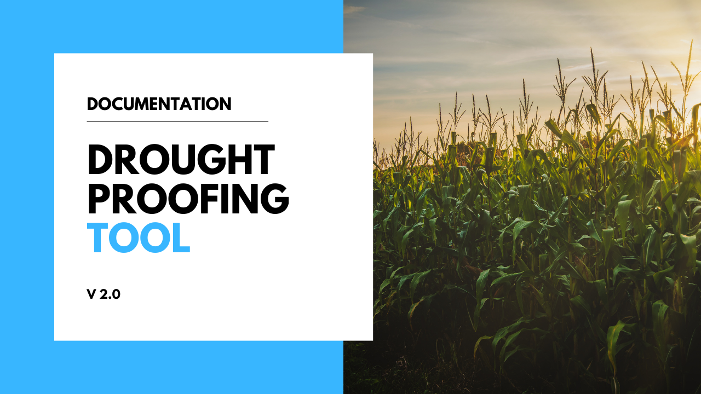
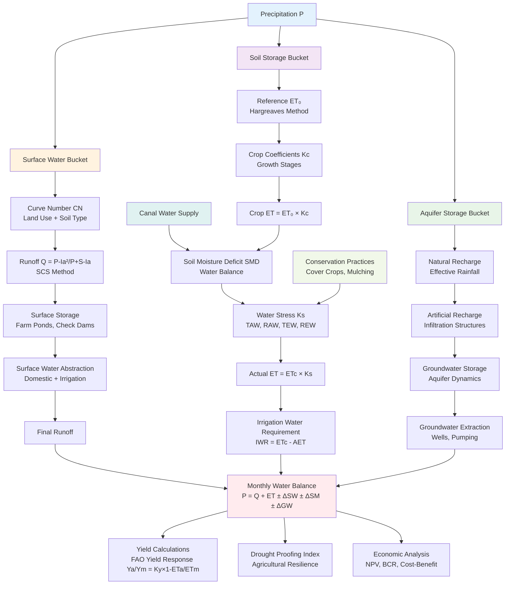

# Drought Proofing Tool Documentation

<div style="text-align: center; margin: 20px 0;">
    
</div>

Welcome to the comprehensive documentation for the Drought Proofing Tool - a sophisticated water resource management and drought analysis system.


## Overview

The Drought Proofing Tool is a Python-based application designed to analyze water resources, model drought scenarios, and evaluate agricultural interventions. This tool helps in understanding water balance dynamics across different storage buckets and provides insights for drought-resilient planning.

## Project Structure

The project is organized into several key modules:

### Core Modules

- **[:material-water: Aquifer Storage Bucket](aquifer_storage_bucket.md)** - Groundwater storage and management
- **[:material-cog: Orchestrator](orchestrator.md)** - Main coordination and workflow management with auto-conversion
- **[:material-chart-bar: Outputs](outputs.md)** - Data processing and visualization
- **[:material-wrench: Shared](shared.md)** - Common utilities with plot-based processing functions
- **[:material-sprout: Soil Storage Bucket](soil_storage_bucket.md)** - Soil moisture and agricultural analysis
- **[:material-waves: Surface Water Bucket](surface_water_bucket.md)** - Surface water flow and runoff management

### NEW: User Interface Module

- **[:material-file-code: Converter](converter.md)** - Tabular to key-value file conversion for user-friendly data entry

### Data & Legacy

- **:material-folder: Datasets** - Input/output data files and configurations
- **:material-file-document: Original** - Legacy source files and initial implementations

## Architecture Philosophy

### Drought Proofing Framework

The core philosophy centers on the interaction between:

- **Water Availability** (% of crop water needs met)
- **Water Use Efficiency** (productive use of available water)

This creates four operational quadrants for intervention planning:

1. **Ideal**: High availability + High efficiency
2. **Opportunity**: High availability + Low efficiency → Focus on efficiency improvements
3. **Elimination**: Low availability + Low efficiency → Comprehensive interventions needed
4. **Supply Focus**: Low availability + High efficiency → Focus on water supply augmentation

### Modular Design

Each bucket operates independently but interconnects through water flows, allowing:

- Flexible intervention modeling
- Scalable analysis from field to watershed level
- Integration of supply-side, demand-side, and soil moisture interventions

### Decision Support

Designed as a farmer-friendly tool that translates complex hydrological processes into actionable insights for drought resilience planning.

## Three-Bucket Water Balance System

The tool implements a comprehensive three-bucket water balance approach:



The tool is built around a conceptual framework that partitions water resources into three interconnected storage buckets:

- **Surface Water Bucket** - Handles runoff, reservoirs, and surface storage
- **Soil Storage Bucket** - Manages soil moisture, evapotranspiration, and crop water dynamics
- **Aquifer Storage Bucket** - Controls groundwater recharge, storage, and extraction

## Key Features

- **Water Balance Modeling** - Comprehensive three-bucket water balance system
- **Drought Analysis** - Advanced drought metrics and scenario modeling
- **Agricultural Impact Assessment** - Crop yield and water stress analysis
- **Economic Evaluation** - Cost-benefit analysis of interventions
- **Flexible Configuration** - Customizable parameters and scenarios

## Getting Started

1. **Main Entry Point**: `run.py` - Primary execution script with auto-conversion
2. **User Configuration**: Edit `interventions_scenario_X_correct.csv` files directly in tabular format
3. **Automatic Processing**: System converts and runs scenarios automatically
4. **Advanced Configuration**: Modify other input parameters in `Datasets/Inputs/`
5. **Execution**: Run analysis through the orchestrator module with plot-based processing
6. **Results**: View outputs in `Datasets/Outputs/[Scenario_Name]/`

## Enhanced Workflow (NEW!)

### User-Friendly Data Entry
```
1. Edit tabular CSV files → interventions_scenario_X_correct.csv
2. Run python run.py X → Auto-conversion + Processing
3. View results → Datasets/Outputs/Scenario_X/
```

### Plot-Based System
- **Dynamic crop-plot mapping** - automatically detects crop assignments
- **No hardcoded seasons** - flexible plot configuration
- **Backward compatible** - works with existing seasonal data

## Quick Navigation

Use the navigation tree on the left to explore:

- Individual module documentation
- Python file listings and descriptions
- Data structure explanations
- Usage examples and workflows

## System Requirements

- Python 3.x
- Required packages listed in `requirements.txt`
- Input data files in CSV format
- Sufficient storage for output generation

## Authors & Development

**Developed by:**
- **International Water Management Institute (IWMI)**
- **CGIAR** - Research Program on Water, Land and Ecosystems

**Technical Approach:**

- Monthly water balance methodology
- Three-bucket water balance system (Surface, Soil, Aquifer)
- SCS Curve Number method for runoff estimation
- FAO Penman-Monteith evapotranspiration calculations
- Yield response functions for crop productivity assessment

## Reference Documentation

For comprehensive technical details, methodology, and implementation guidance, refer to the **[Tool Technical Manual](../Tool_Technical Manual.pdf)** which covers:

- Complete water balance equations and algorithms
- Intervention impact modeling approaches
- Economic analysis and benefit-cost calculations
- Data sources and parameter specifications
- Validation and calibration procedures

---

*This documentation provides detailed insights into each component of the Drought Proofing Tool. Select a module from the navigation menu to explore specific functionality and Python implementations.*
