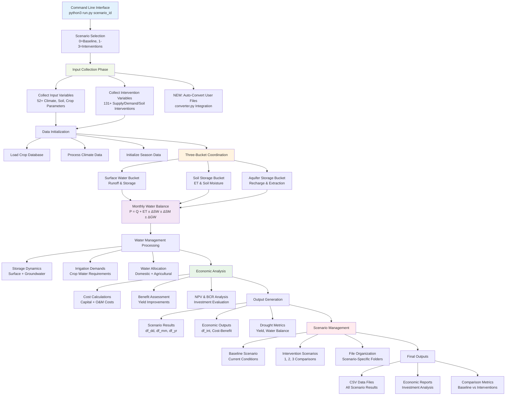

# Orchestrator

The Orchestrator module serves as the central coordination hub for the Drought Proofing Tool, managing the execution flow of the three-bucket water balance system and coordinating complex water resource management processes.

## Overview

This module handles:

- **Input data collection** from CSV files and manual sources
- **Main process coordination** across all three water balance buckets
- **Water balance orchestration** including storage dynamics and irrigation demands
- **Scenario management** for baseline and intervention comparisons
- **Output generation** and data aggregation across all modules
- **Command-line interface** for tool execution with scenario parameters

## Orchestrator Workflow

The orchestrator coordinates the entire drought proofing analysis through systematic workflow management:



## Module Structure

### Input Data Management

**Parameter collection and organization:**

- **`input_collector.py`** - Collects and organizes all input and intervention variables from various sources into structured dictionaries

### Main Process Control

**Core orchestration and workflow management:**

- **`main_controller.py`** - Controls main drought proofing routines including scenario management, data processing orchestration, and output generation
- **`water_balance_coordinator.py`** - Coordinates complex water balance calculations including storage dynamics, irrigation demands, and groundwater abstractions

## Technical Implementation

### Monthly Water Balance Methodology

The orchestrator implements a comprehensive monthly water balance approach as described in the Tool Technical Manual:

```
P = Q + ET ± AQ_ST + SM_ST ± SW_ST
```

Where:
- P = Precipitation
- Q = Runoff
- ET = Evapotranspiration
- AQ_ST = Aquifer storage
- SM_ST = Soil moisture storage
- SW_ST = Surface water storage

### Input Variable Collection System

Manages comprehensive parameter collection across multiple categories:

```python
# input_collector.py - Function 001: Collects all input variables into ordered dictionary
def collect_inp_variables(inp_source, master_path):
    """Collect and organize 52+ input variables including climate, crops, and infrastructure"""

    variables_list = [
        # Climate and location parameters
        (0, "latitude", lambda: get_variable_value(inp_source, master_path, "latitude", 0)),
        (1, "kei", lambda: get_kei_value(get_variable_value(inp_source, master_path, "climate", 1))),

        # Soil characteristics
        (2, "Soil_type1", lambda: get_variable_value(inp_source, master_path, "Soil_type1", 2)),
        (3, "Soil_type2", lambda: get_variable_value(inp_source, master_path, "Soil_type2", 3)),
        (4, "HSC1", lambda: get_variable_value(inp_source, master_path, "HSC1", 4)),
        (5, "HSC2", lambda: get_variable_value(inp_source, master_path, "HSC2", 5)),

        # Multi-season crop management (supports both seasonal and plot-based)
        # Kharif season (16-23) - backward compatibility
        (16, "Kharif_Crops", lambda: get_crops_variable_values(inp_source, master_path, "Kharif_Crops", 16)),
        (17, "Kharif_Sowing_Month", lambda: get_crops_variable_values(inp_source, master_path, "Kharif_Sowing_Month", 17)),

        # Rabi season (24-31) - backward compatibility
        (24, "Rabi_Crops", lambda: get_crops_variable_values(inp_source, master_path, "Rabi_Crops", 24)),

        # Summer season (32-39) - backward compatibility
        (32, "Summer_Crops", lambda: get_crops_variable_values(inp_source, master_path, "Summer_Crops", 32)),

        # Infrastructure parameters
        (44, "Aquifer_Depth", lambda: get_variable_value(inp_source, master_path, "Aquifer_Depth", 44)),
        (47, "Population", lambda: get_variable_value(inp_source, master_path, "Population", 47)),
    ]

    # Create ordered dictionary for systematic parameter management
    variables_dict = {}
    for index, var_name, func in sorted(variables_list, key=lambda x: x[0]):
        variables_dict[var_name] = func()

    return variables_dict
```

### NEW: Plot-Based Processing System

The orchestrator now implements dynamic plot-to-crop mapping and intervention processing:

```python
# shared/crop_processing.py - NEW: Dynamic plot-to-crop mapping
def get_dynamic_crop_plot_mapping(inp_source, master_path):
    """
    Dynamically creates mapping between plot numbers and crop names
    Returns: {1: 'Chilli', 2: 'Tobacco', 3: 'Pulses'} (example)
    Supports both plot-based and seasonal backward compatibility
    """
    plot_to_crop = {}
    
    for plot_num in [1, 2, 3]:
        # Try plot-based naming first
        possible_keys = [
            f"Plot_{plot_num}_Crop",
            f"Plot{plot_num}_Crop",
        ]
        # Fallback to seasonal mapping for backward compatibility
        season_mapping = {1: 'Kharif', 2: 'Rabi', 3: 'Summer'}
        if plot_num in season_mapping:
            possible_keys.append(f"{season_mapping[plot_num]}_Crops")
    
    return plot_to_crop

# shared/crop_processing.py - NEW: Plot-based intervention mapping
def map_plot_interventions_to_crops(attribute_name, int_var, plot_to_crop_mapping, inp_source, master_path, scenario_num):
    """
    Maps plot-based intervention areas to specific crops dynamically.
    Handles all 14 intervention types without hardcoding.
    """
    # Determine appropriate utility function based on intervention type
    if intervention_type in ["Drip_Area", "Sprinkler_Area", "Land_Levelling_Area", "DSR_Area", "AWD_Area", "SRI_Area", "Ridge_Furrow_Area", "Deficit_Area"]:
        from shared.input_utilities import get_demand_side_interv_area_values
        utility_function = get_demand_side_interv_area_values
    else:  # Soil moisture interventions
        from shared.input_utilities import get_soil_moisture_interv_area_values
        utility_function = get_soil_moisture_interv_area_values
    
    # Process each crop using plot-based keys like "Crop_Area_1_Drip_Area"
    crop_interventions = []
    for plot_num in sorted(plot_to_crop_mapping.keys()):
        plot_key = f"Crop_Area_{plot_num}_{intervention_type}"
        intervention_area = utility_function(inp_source, master_path, plot_key, 0, scenario_num)
        crop_interventions.append(intervention_area)
    
    return crop_interventions
```

### Intervention Parameter Management

Handles complex intervention scenarios with **131+ parameters** (updated from 126):

```python
# input_collector.py - Function 002: Collects all intervention variables
def collect_int_variables(inp_source, master_path):
    """Organize intervention parameters across supply-side, demand-side, and soil moisture categories"""

    variables_list = [
        # Economic parameters
        (0, "Time_Period", lambda: get_supply_side_int_values(inp_source, master_path, "Time_Period", 0)),
        (1, "Interest_Rate", lambda: get_supply_side_int_values(inp_source, master_path, "Interest_Rate", 1)),

        # Supply-side interventions (2-30)
        (2, "Farm_Pond_Vol", lambda: get_supply_side_int_values(inp_source, master_path, "Farm_Pond_Vol", 2)),
        (14, "Check_Dam_Vol", lambda: get_supply_side_int_values(inp_source, master_path, "Check_Dam_Vol", 14)),
        (20, "Infiltration_Pond_Vol", lambda: get_supply_side_int_values(inp_source, master_path, "Infiltration_Pond_Vol", 20)),

        # Demand-side interventions (31-81) - NOW SUPPORTS PLOT-BASED
        (31, "Crop_Area_1_Drip_Area", lambda: get_demand_side_interv_area_values(inp_source, master_path, "Crop_Area_1_Drip_Area", 31)),
        (58, "Crop_Area_1_AWD_Area", lambda: get_demand_side_interv_area_values(inp_source, master_path, "Crop_Area_1_AWD_Area", 58)),

        # Soil moisture interventions (82-131) - NOW SUPPORTS PLOT-BASED  
        (82, "Crop_Area_1_Cover_Crops_Area", lambda: get_soil_moisture_interv_area_values(inp_source, master_path, "Crop_Area_1_Cover_Crops_Area", 82)),
        (121, "Red_CN_Tank", lambda: get_soil_moisture_interv_values(inp_source, master_path, "Red_CN_Tank", 121)),
        
        # NEW: Check_Dam_Units parameter (parameter 131)
        (130, "Check_Dam_Units", lambda: get_supply_side_int_values(inp_source, master_path, "Check_Dam_Units", 130)),
    ]

    return variables_dict
```

### Main Process Orchestration

Coordinates the entire drought proofing workflow through systematic process management:

```python
# main_controller.py - Function 005: Main orchestrator running all drought proofing processes
def dr_prf_all_processes(inp_source, master_path, file_paths, year_type, counter):
    """Execute comprehensive 8-step drought proofing methodology"""

    # Step 1: Collect input parameters
    inp_var = collect_inp_variables(inp_source, master_path)
    int_var = collect_int_variables(inp_source, master_path)

    # Step 2: Initialize data structures and crop management
    crop_df = get_crop_data(file_paths["crop_db"])
    season_data = get_season_data(inp_source, master_path)
    df_cp, num_plots = assign_plots_to_crops(season_data)

    # Step 3: Process climate data and calculate ET₀
    df_dd = get_pcp_value(file_paths["daily_data"])
    df_mm = process_monthly_data(df_dd, file_paths, inp_source, master_path)
    df_dd = calculate_daily_etoi(df_mm, df_dd)

    # Step 4: Calculate crop water requirements and soil properties
    valid_crops_df = select_valid_crops(df_cp)
    all_crops = valid_crops_df["Crop"].tolist()
    all_plots = valid_crops_df["Plot"].unique().tolist()

    # Step 5: Process curve numbers and runoff calculations
    df_cc, actual_fallow_cn2, actual_cn2 = process_cn_values(seasons, df_cc, crop_df, soil_output_list, all_crops, inp_source, master_path)
    df_dd = calc_discharge(df_dd, df_crop, fixed_values_list)

    # Step 6: Coordinate water balance across all buckets
    df_mm = process_water_management(df_mm, all_crops, surface_areas, added_recharges, water_resource_list, aquifer_para_list, file_paths["irrigation"])

    # Step 7: Economic analysis and intervention evaluation
    economic_list = [float(int_var["Interest_Rate"]), float(int_var["Time_Period"])]
    df_int = calculate_intervention_economics(economic_list, df_cc, inp_source, master_path)

    # Step 8: Generate outputs and return consolidated results
    output_dictionary = {
        "df_dd.csv": df_dd,           # Daily data
        "df_mm.csv": df_mm,           # Monthly data
        "df_crop.csv": df_crop,       # Crop data
        "df_yr.csv": df_yr,           # Yearly aggregation
        "df_cc.csv": df_cc,           # Crop coefficients
        "df_int.csv": df_int,         # Economic analysis
        # Additional output files...
    }

    return output_dictionary
```

### Water Balance Coordination

Manages complex water allocation and storage dynamics:

```python
# water_balance_coordinator.py - Function 001: Processes water management including storage and irrigation
def process_water_management(df_mm, all_crops, surface_areas, added_recharges, water_resource_list, inp_aquifer_para, irrigation):
    """Coordinate water allocation across surface, soil, and groundwater storage"""

    # Calculate storage dynamics
    df_mm = calc_storage_residualgw(df_mm, inp_aquifer_para)
    df_mm["Accumulated_natural_recharge"] = mm_to_m3(to_float(inp_aquifer_para[3], 0), df_mm["Recharge"])

    # Process surface water components
    total_surface_area_farm = surface_areas["farm"]
    df_mm = calc_potential_et(total_surface_area_farm, df_mm)
    df_mm = calc_canal_supply(df_ir, df_mm)

    # Calculate water demands
    df_mm = calc_domestic_need(population, domestic_water_use, df_mm)
    df_mm = calc_other_need(other, other_water_use, df_mm)
    df_mm = calc_gw_need(df_mm, groundwater_dependent)
    df_mm = calc_sw_need(df_mm)

    # Allocate water resources
    df_mm = calc_sw_abstracted(df_mm)
    df_mm = calc_storage(df_mm, sw_storage_capacity_created, added_recharge_capacity, storage_limit)

    return df_mm

# water_balance_coordinator.py - Function 003: Complex storage dynamics and abstractions
def calc_storage(df_mm, sw_storage_capacity_created, added_recharge_capacity, storage_limit):
    """Implement monthly water storage allocation algorithm"""

    # Calculate demand priorities and allocation
    denominator = df_mm["Potential_recharge"] + df_mm["Potential_ET"] + df_mm["IWR_after_canal"]
    denominator[denominator == 0] = np.inf

    # Apply allocation logic for each month
    for i in range(len(df_mm)):
        # Determine if all requirements can be met
        df_mm.loc[i, "all_req_met"] = np.where(
            df_mm.loc[i, "Potential_recharge"] + df_mm.loc[i, "Potential_ET"] + df_mm.loc[i, "IWR_after_canal"] > df_mm.loc[i, "Storage"], 0, 1
        )

        # Proportional allocation when storage is insufficient
        if df_mm.loc[i, "all_req_met"] == 0:
            allocation_factor = df_mm.loc[i, "Storage"] / denominator[i]
            df_mm.loc[i, "Actual_Recharge"] = allocation_factor * df_mm.loc[i, "Potential_recharge"]
            df_mm.loc[i, "Actual_ET"] = allocation_factor * df_mm.loc[i, "Potential_ET"]
            df_mm.loc[i, "Actual_IWR"] = allocation_factor * df_mm.loc[i, "IWR_after_canal"]

        # Handle rejected recharge when storage exceeds capacity
        df_mm.loc[i, "Rejected_recharge"] = max(0, df_mm.loc[i, "Cumulative_left_after_crop_abstraction"] - storage_limit)

    return df_mm
```

### Scenario Management System

Supports baseline and intervention scenario comparisons:

```python
# main_controller.py - Function 001: Saves all output dataframes to CSV files in scenario-specific folders
def save_dataframes_scenario(val_scenario, master_path, output_dictionary, inp_source):
    """Save results with scenario-specific naming and organization"""

    # Create scenario-specific output directory
    output_dir = os.path.join(master_path, "Datasets", "Outputs")
    if val_scenario == 0:
        scenario_folder = os.path.join(output_dir, "Baseline_Scenario")
    else:
        scenario_folder = os.path.join(output_dir, f"Scenario_{val_scenario}")

    os.makedirs(scenario_folder, exist_ok=True)

    # Save input and intervention parameters for reproducibility
    save_dictionaries_to_csv(val_scenario, inp_source, scenario_folder)

    # Generate scenario-specific file names
    dict_save_file = []
    for filename, df in output_dictionary.items():
        if val_scenario == 0:
            scenario_filename = f"{filename.replace('.csv', '')}_Baseline_Scenario.csv"
        else:
            scenario_filename = f"{filename.replace('.csv', '')}_Scenario_{val_scenario}.csv"

        output_path = os.path.join(scenario_folder, scenario_filename)
        df.to_csv(output_path, index=(filename == "df_cc.csv"), float_format='%.6g')
        dict_save_file.append(output_path)

    return dict_save_file
```

## Key Parameters

### Input Variable Categories
- **Climate Parameters** - Latitude, temperature data, reference ET calculations
- **Soil Properties** - Soil types, hydrological soil groups, field capacity parameters
- **Crop Management** - Multi-season crops (Kharif, Rabi, Summer), sowing dates, areas
- **Land Use** - Net crop area, fallow land, built-up areas, water bodies
- **Infrastructure** - Aquifer depth, specific yield, population, water demands

### Intervention Categories
- **Supply-Side (31 parameters)** - Farm ponds, check dams, infiltration ponds, injection wells (NEW: Check_Dam_Units added)
- **Demand-Side (50 parameters)** - Drip/sprinkler irrigation, land leveling, deficit irrigation (NOW: Plot-based processing)
- **Soil Moisture (50 parameters)** - Cover crops, mulching, conservation tillage, contour bunds (NOW: Plot-based processing)

### NEW: Dynamic Intervention Detection
All 14 intervention types now processed dynamically without hardcoding:
- **Demand-side (8 types)**: Drip, Sprinkler, Land_Levelling, DSR, AWD, SRI, Ridge_Furrow, Deficit
- **Soil moisture (6 types)**: BBF, Cover_Crops, Mulching, Bunds, Tillage, Tank

### Economic Parameters
- **Investment Analysis** - Time period (20 years), interest rates (6-10%)
- **Cost Components** - Capital costs, maintenance costs, lifespan considerations
- **Benefit Calculations** - Yield improvements, NPV analysis, BCR ratios

## Integration with Other Modules

### Coordination Role
The orchestrator serves as the central hub connecting:
- **Aquifer Storage Bucket** - Provides groundwater parameters and storage limits
- **Soil Storage Bucket** - Supplies crop coefficients and soil moisture calculations
- **Surface Water Bucket** - Delivers runoff calculations and curve number processing
- **Shared Module** - Utilizes utilities, data readers, and economic analysis functions
- **Outputs Module** - Coordinates result aggregation and yield calculations

### Data Flow Management
1. **Input Collection** → Parameter gathering from CSV/manual sources
2. **Module Coordination** → Sequential processing across three buckets
3. **Water Balance** → Monthly allocation and storage dynamics
4. **Economic Analysis** → Intervention cost-benefit evaluation
5. **Output Generation** → Scenario-specific result compilation

## Usage in Drought Scenarios

The orchestrator enables comprehensive drought analysis through:

1. **Baseline Scenario** - Establishes current water balance conditions
2. **Intervention Scenarios** - Models impact of various drought-proofing measures
3. **Comparative Analysis** - Evaluates effectiveness across different strategies
4. **Economic Evaluation** - Determines cost-effectiveness of interventions
5. **Decision Support** - Provides quantitative basis for drought resilience planning

## Command-Line Execution

The orchestrator supports flexible execution through the main entry point:

```bash
# Run baseline scenario
python3 run.py

# Run specific intervention scenarios
python3 run.py 1    # Scenario 1
python3 run.py 2    # Scenario 2
python3 run.py 3    # Scenario 3

# Parallel scenario execution
python3 run.py 1 &
python3 run.py 2 &
python3 run.py 3 &
```

---

*For detailed methodology and equations, refer to the [Tool Technical Manual](../Tool_Technical Manual.pdf), Section 2.*