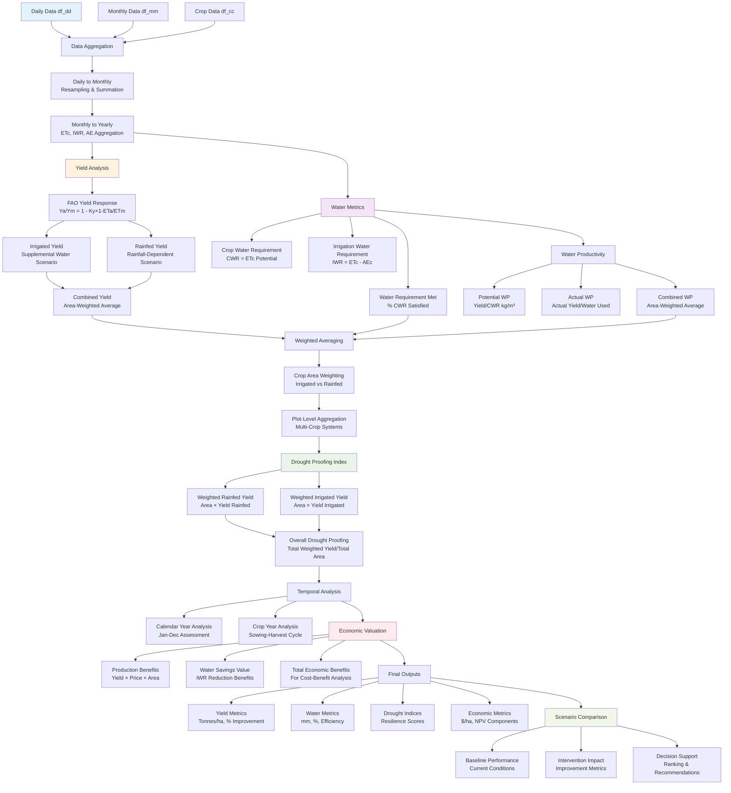

# Outputs

The Outputs module processes and aggregates results from the drought proofing tool, generating comprehensive metrics, yield calculations, and drought assessments for decision-making support.

## Overview

This module handles:

- **Data aggregation** from daily to monthly and yearly time scales
- **Yield calculations** for irrigated and rainfed crops under water stress scenarios
- **Water requirement metrics** including irrigation fulfillment and crop water availability
- **Drought proofing indices** for calendar and crop year analysis
- **Weighted averages** across crop areas and intervention scenarios
- **Output processing** for baseline and intervention comparison

## Outputs Processing Flow

The outputs module transforms raw simulation data into decision-support metrics:



## Module Structure

### Core Processing Functions

**Data aggregation and temporal processing:**

- **`output_aggregator.py`** - Handles yearly resampling, weighted averages, and multi-temporal data processing
- **`yield_calculations.py`** - Calculates crop yields under different water stress scenarios using FAO methodology
- **`water_metrics.py`** - Computes water requirement metrics and irrigation fulfillment percentages
- **`drought_metrics.py`** - Generates drought proofing indices for scenario evaluation

## Technical Implementation

### Data Aggregation and Yearly Processing

The outputs module implements comprehensive data aggregation from monthly to yearly scales with weighted averaging:

```python
# output_aggregator.py - Function 001: Resamples monthly data to yearly aggregates
def get_resample_yr_optimized(df_mm, crops):
    print("FUNCTION 51: get_resample_yr_optimized() - Resampling yearly data")
    # List of columns to resample
    cols_to_resample = [f"ETci_{crop}" for crop in crops] + \
                       [f"Irr_CWR_met_{crop}" for crop in crops] + \
                       [f"Rainfed_CWR_met_{crop}" for crop in crops] + \
                       [f"AE_crop_{crop}" for crop in crops] + \
                       [f"AE_soil_{crop}" for crop in crops] + \
                       [f"IWR_{crop}" for crop in crops]
    # Resample the specified columns
    df_yr = df_mm[["Date"] + cols_to_resample].set_index("Date").resample("Y").sum().reset_index()
    return df_yr
```

### Weighted Average Calculations

Comprehensive weighted averaging system for crop yields and water metrics:

```python
# output_aggregator.py - Function 002: Calculates weighted averages for yield and water metrics
def calculate_weighted_averages(df_cc, df_yr, all_crops, yield_columns, other_columns):
    print("FUNCTION 54: calculate_weighted_averages() - Calculating weighted averages")
    # Initialize drought proofing components
    total_weighted_rainfed_yield = pd.Series(0, index=df_yr.index)
    total_weighted_irrigated_yield = pd.Series(0, index=df_yr.index)
    total_rainfed_area = df_cc["Rainfed_Area"].sum()
    total_irrigated_area = df_cc["Irr_Area"].sum()

    # Calculate weighted averages for yield-related metrics
    for output_column, (yield_template, area_column) in yield_columns.items():
        total_weighted_yield = pd.Series(0, index=df_yr.index)
        total_area = df_cc[area_column].sum()

        for crop in all_crops:
            yield_col = yield_template.format(crop=crop)
            if yield_col in df_yr.columns:
                area = df_cc.at[crop, area_column]
                total_weighted_yield += df_yr[yield_col] * area
                if area_column == "Rainfed_Area":
                    total_weighted_rainfed_yield += df_yr[yield_col] * area
                elif area_column == "Irr_Area":
                    total_weighted_irrigated_yield += df_yr[yield_col] * area

        df_yr[output_column] = ((total_weighted_yield / total_area) * 100) if total_area > 0 else 0

    # Calculate the "Drought Proofing" metric
    df_yr["Drought Proofing"] = (total_weighted_rainfed_yield + total_weighted_irrigated_yield) / (
                total_rainfed_area + total_irrigated_area)
    return df_yr
```

### Water Year Data Processing

Flexible water year analysis supporting both calendar and crop year approaches:

```python
# output_aggregator.py - Function 004: Processes water year data for crop or calendar year
def process_water_year_data(df_mm, df_cp, crops, year_type="crop"):
    # Prepare df_wb_mm with renamed columns
    df_wb_mm = df_mm[["Date", "Rain", "Final_Runoff", "Final_Recharge", "Final_ET", "Final_ET_Bio"]].copy()
    df_wb_mm.columns = ["Date", "Rain(mm)", "Runoff(mm)", "Recharge(mm)", "ET(mm)", "ET_Bio(mm)"]
    # Get the result month from the provided function
    result_month = get_sowing_month(df_cp)
    if result_month is None or result_month == "":
        result_month = "Jun"  # Default to June if no month found
    result_month_num = pd.to_datetime(f"{result_month} 1, 2000").month

    if year_type.strip().lower() == "calendar":
        water_year = df_mm["Date"].dt.year
    else:
        water_year = df_mm["Date"].dt.year.where(df_mm["Date"].dt.month >= result_month_num,
                                                 df_mm["Date"].dt.year - 1)

    df_mm = df_mm.assign(water_year=water_year)
    df_wb_mm = df_wb_mm.assign(water_year=water_year)

    # Create the column list to resample
    col_to_resample = [f"ETci_{crop}" for crop in crops] + \
                      [f"IWR_{crop}" for crop in crops] + \
                      [f"Irr_CWR_met_{crop}" for crop in crops] + \
                      [f"Rainfed_CWR_met_{crop}" for crop in crops]
    # Group by water year and sum for crops
    df_crop_yr = df_mm.groupby("water_year")[col_to_resample].sum().reset_index()
    # Group by water year and sum for water balance data
    df_wb_yr = df_wb_mm.groupby("water_year", as_index=False).agg({
        "Rain(mm)": "sum",
        "Runoff(mm)": "sum",
        "Recharge(mm)": "sum",
        "ET(mm)": "sum",
        "ET_Bio(mm)": "sum"
    })
    return df_crop_yr, df_wb_yr, df_wb_mm
```

### Yield Calculations Under Water Stress

Implementation of FAO yield response methodology for water stress scenarios:

```python
# yield_calculations.py - Function 001: Calculates crop yields for irrigated and rainfed areas
def calculate_yields(df_yr, df_cc, crop, irr_area, rainfed_area, ky_value, total_area, final_eff):
    etci_col = f"ETci_{crop}"
    irr_cwr_col = f"Irr_CWR_met_{crop}"
    rainfed_cwr_col = f"Rainfed_CWR_met_{crop}"

    new_cols = {}

    # Calculate the "%Irr_CWR_met_{crop}" column
    if irr_area == 0:
        new_cols[f"%Irr_CWR_met_{crop}"] = 0
    else:
        new_cols[f"%Irr_CWR_met_{crop}"] = df_yr[irr_cwr_col] / df_yr[etci_col]
    # Calculate the "%Rainfed_CWR_met_{crop}" column
    if rainfed_area == 0:
        new_cols[f"%Rainfed_CWR_met_{crop}"] = 0
    else:
        new_cols[f"%Rainfed_CWR_met_{crop}"] = df_yr[rainfed_cwr_col] / df_yr[etci_col]
    # Calculate Combined CWR
    new_cols[f"%Combined_CWR_met_{crop}"] = ((new_cols[f"%Irr_CWR_met_{crop}"] * irr_area) +
                                             (new_cols[f"%Rainfed_CWR_met_{crop}"] * rainfed_area)) / total_area
    # Calculate yields using FAO yield response function
    new_cols[f"Irr_yield_{crop}"] = np.where(
        irr_area == 0,
        0,
        np.maximum(1 - ky_value * (1 - (df_yr[irr_cwr_col] / df_yr[etci_col])), 0)
    )
    new_cols[f"Rainfed_yield_{crop}"] = np.where(
        rainfed_area == 0,
        0,
        np.maximum(1 - ky_value * (1 - (df_yr[rainfed_cwr_col] / df_yr[etci_col])), 0)
    )
    # Calculate Average Yield
    new_cols[f"Avg_yield_{crop}"] = np.where(
        total_area == 0,
        0,
        ((new_cols[f"Irr_yield_{crop}"] * irr_area) + (new_cols[f"Rainfed_yield_{crop}"] * rainfed_area)) / total_area
    )

    # Add comprehensive water productivity metrics
    new_cols[f"Potential_Yield_{crop} (Kg/ha)"] = df_cc.at[crop, "Yield (tonne/ha)"] * 1000
    new_cols[f"Potential_WP_{crop} (kg/cu.m)"] = new_cols[f"Potential_Yield_{crop} (Kg/ha)"] / new_cols[
        f"Combined CWR_{crop}(cu.m/ha)"]
    new_cols[f"Combined_WP_{crop} (kg/cu.m)"] = (new_cols[f"Avg_yield_{crop}"] * new_cols[
        f"Potential_Yield_{crop} (Kg/ha)"]) / new_cols[f"Combined CWA_{crop}(cu.m/ha)"]

    # Add all new columns at once
    df_yr = pd.concat([df_yr, pd.DataFrame(new_cols)], axis=1)
    return df_yr
```

### Water Requirement Metrics

Comprehensive water requirement analysis and irrigation fulfillment calculations:

```python
# water_metrics.py - Function 001: Calculates percentage of irrigation water requirement fulfilled
def calc_per_irr_water_req_fulfilled(df_mm):
    df_mm["Percent_Irr_Water_Req_Fulfilled"] = np.where(
        df_mm["Total Irrigated Area"] == 0,
        0,
        np.where(
            df_mm["Irr_water_need"] == 0,
            1,
            safe_divide(df_mm["Actual_IWR"] + df_mm["GW_extracted"], df_mm["Irr_water_need"])
        )
    )
    return df_mm

# water_metrics.py - Function 002: Calculates crop water requirement met for each crop
def calc_cwr_met(df_mm, crops):
    for crop in crops:
        etci_col = f"ETci_{crop}"
        iwr_col = f"IWR_{crop}"
        percent_irrigation_col = "Percent_Irr_Water_Req_Fulfilled"
        irr_cwr_col = f"Irr_CWR_met_{crop}"
        rainfed_cwr_col = f"Rainfed_CWR_met_{crop}"
        irr_cwr_col_per = f"%Irr_CWR_met_{crop}"
        rainfed_cwr_col_per = f"%Rainfed_CWR_met_{crop}"
        if etci_col in df_mm.columns and iwr_col in df_mm.columns and percent_irrigation_col in df_mm.columns:
            df_mm[irr_cwr_col] = (df_mm[etci_col] - df_mm[iwr_col]) + df_mm[iwr_col] * df_mm[percent_irrigation_col]
            df_mm[rainfed_cwr_col] = df_mm[etci_col] - df_mm[iwr_col]
            df_mm[irr_cwr_col_per] = safe_divide(df_mm[irr_cwr_col], df_mm[etci_col])
            df_mm[rainfed_cwr_col_per] = safe_divide(df_mm[rainfed_cwr_col], df_mm[etci_col])
        else:
            print(f"Error: Required columns for {crop} not found in dataframe")
    return df_mm
```

### Drought Proofing Index Calculation

Simple but effective drought proofing metrics for calendar and crop year analysis:

```python
# drought_metrics.py - Function 001: Gets drought proofing index
def get_drought_proofness(df_yr):
    df_drought = pd.DataFrame({"Date": df_yr["Date"]})
    df_drought["Drought Proofing"] = df_yr["Drought Proofing"]
    return df_drought

# drought_metrics.py - Function 002: Gets drought proofing index for crop year
def get_drought_proofness_cyr(df_crop_yr):
    df_drought = pd.DataFrame({"Date": df_crop_yr["water_year"]})
    df_drought["Drought Proofing"] = df_crop_yr["Drought Proofing"]
    return df_drought
```

### Multi-Temporal Output Processing

Flexible processing system supporting both calendar and crop year analysis:

```python
# output_aggregator.py - Function 003: Processes year data based on calendar or crop year
def process_year_data(df_yr, df_crop_yr, all_crops, year_type):
    print("FUNCTION 69: process_year_data() - Processing year data")
    year_type = year_type.strip().lower()

    if year_type == "calendar":
        # Run the functions if it's a calendar year
        df_cwr = water_metrics.get_cwr_mm(df_yr, all_crops)
        df_cwr_met = water_metrics.get_cwr_met(df_yr, all_crops)
        df_yield = yield_calculations.get_yield_per(df_yr, all_crops)
        df_drought = drought_metrics.get_drought_proofness(df_yr)

    elif year_type == "crop":
        # Run the crop year functions
        df_cwr = water_metrics.get_cwr_mm_cyr(df_crop_yr, all_crops)
        df_cwr_met = water_metrics.get_cwr_met_cyr(df_crop_yr, all_crops)
        df_yield = yield_calculations.get_yield_per_cyr(df_crop_yr, all_crops)
        df_drought = drought_metrics.get_drought_proofness_cyr(df_crop_yr)

    else:
        raise ValueError("Invalid year_type. Please choose either 'calendar' or 'crop'.")
    return df_cwr, df_cwr_met, df_yield, df_drought
```

## Technical Methodology

### FAO Yield Response Function

The outputs module implements the FAO yield response function for calculating crop yields under water stress conditions, as described in the Tool Technical Manual:

```
(1 - Ya/Ym) = Ky × (1 - ETa/ETm)
```

Where:
- **Ya** = Actual yield
- **Ym** = Maximum yield
- **Ky** = Yield response factor
- **ETa** = Actual evapotranspiration (AEc + met IWR)
- **ETm** = Maximum evapotranspiration (ETc)

### Water Productivity Calculations

The module calculates multiple water productivity metrics:

- **Potential Water Productivity**: Potential yield per unit of crop water requirement
- **Actual Water Productivity**: Actual yield per unit of water consumed
- **Combined Water Productivity**: Area-weighted average across irrigated and rainfed areas

### Drought Proofing Framework Integration

The outputs module implements the core drought proofing framework concept:

**Drought Proofing Index** = (Weighted Rainfed Yield + Weighted Irrigated Yield) / (Total Rainfed Area + Total Irrigated Area)

This index represents the overall agricultural productivity under water stress conditions, enabling comparison between baseline and intervention scenarios.

## Key Output Categories

### Yield Metrics
- **Irrigated Yield** - Productivity under supplemental irrigation
- **Rainfed Yield** - Productivity under rainfall-dependent conditions
- **Combined Yield** - Area-weighted average across farming systems
- **Production Estimates** - Total production in tonnes per crop

### Water Requirement Metrics
- **Crop Water Requirement (CWR)** - Potential water needs for optimal growth
- **Irrigation Water Requirement (IWR)** - Supplemental irrigation needs
- **Water Requirement Met** - Percentage of water needs satisfied
- **Water Productivity** - Yield per unit of water consumed

### Drought Assessment Metrics
- **Drought Proofing Index** - Overall agricultural resilience indicator
- **Water Stress Indicators** - Crop-specific water deficit analysis
- **Seasonal Analysis** - Calendar vs crop year performance comparison

## Integration with Other Modules

### Input Dependencies
- **Orchestrator Module** - Receives aggregated monthly data for processing
- **Soil Storage Bucket** - Uses crop evapotranspiration and soil moisture data
- **Surface Water Bucket** - Incorporates irrigation supply and surface water availability
- **Aquifer Storage Bucket** - Integrates groundwater extraction and recharge data

### Data Flow Processing
1. **Monthly Data Input** → Raw monthly water balance and crop data
2. **Aggregation Processing** → Yearly resampling and weighted averaging
3. **Yield Calculations** → FAO methodology implementation for water stress
4. **Water Metrics** → Irrigation fulfillment and requirement analysis
5. **Drought Assessment** → Proofing index calculation and scenario comparison
6. **Output Generation** → Structured results for decision support

## Usage in Drought Scenarios

The outputs module enables comprehensive drought impact assessment through:

1. **Baseline Assessment** - Current agricultural productivity under water stress
2. **Intervention Impact** - Quantified benefits of drought-proofing measures
3. **Scenario Comparison** - Side-by-side evaluation of different strategies
4. **Economic Valuation** - Production-based benefit calculations for cost-benefit analysis
5. **Decision Support** - Evidence-based recommendations for drought resilience planning

The module's flexible temporal analysis (calendar vs crop year) and comprehensive metrics enable stakeholders to understand agricultural vulnerability and evaluate the effectiveness of drought-proofing interventions across different time scales and farming systems.

---

*For detailed yield response equations and water productivity methodology, refer to the [Tool Technical Manual](../Tool_Technical Manual.pdf), Sections 3.7 and 5.*