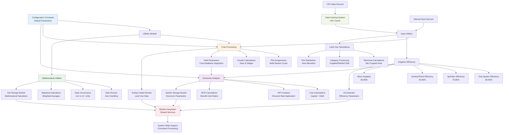

# Shared

The Shared module provides common utilities, configuration constants, and shared functionality that supports all other modules in the drought proofing tool, ensuring consistent data processing and mathematical operations across the entire system.

## Overview

This module handles:

- **Configuration constants** for soil, irrigation, and hydrological parameters
- **Data reading and caching** from CSV files and databases
- **Input utilities** for variable retrieval and processing from multiple sources
- **Crop processing** including plot assignments, growth calculations, and yield parameters
- **Economic analysis** for intervention cost calculations and NPV analysis
- **Irrigation efficiency** calculations from different sources and intervention types
- **Mathematical utilities** for safe operations and data conversions
- **Land use calculations** for total area and category processing

## Shared Module Architecture

The shared module provides foundational services supporting the entire drought proofing system:



## Module Structure

### Core Utility Functions

**Configuration and constants:**

- **`config_constants.py`** - Default values and configuration parameters for soil, irrigation, and system settings
- **`utilities.py`** - Common mathematical operations, data conversions, and processing utilities

**Data processing and input handling:**

- **`data_readers.py`** - CSV file reading, caching, and climate data processing
- **`input_utilities.py`** - Input variable retrieval from CSV or manual sources
- **`crop_processing.py`** - Comprehensive crop data processing and growth calculations

**Specialized calculations:**

- **`economics.py`** - Economic analysis for intervention costs, NPV, and benefit-cost ratios
- **`irrigation_efficiency.py`** - Irrigation efficiency calculations from multiple sources
- **`land_use.py`** - Land use category processing and total area calculations

## Technical Implementation

### Configuration Constants and Default Values

The shared module maintains system-wide configuration constants for consistent parameter usage:

```python
# config_constants.py - Configuration constants for soil and irrigation parameters
# Land and soil parameters
slope = 0                                    # Average land slope (default value is 15)
theta_FC = 420                              # Field capacity (the maximum amount of water soil can hold)
theta_WP = 300                              # Wilting point (the minimum water required by plants to avoid wilting)
Ze = 0.1                                    # Effective rooting depth for crops (in meters)

# Soil moisture retention with conservation practices (%)
Cover_Crops_SM_with_practice = 100          # Soil moisture retention with cover crops (%)
Mulching_SM_with_practice = 100             # Soil moisture retention with mulching (%)
BBF_SM_with_practice = 100                  # Soil moisture retention with broad bed and furrow (BBF) (%)

# Irrigation parameters
Eff_Default_Irrigation = 50                 # Default irrigation efficiency (50%) for SW_Area_Irr_Eff & GW_Area_Irr_Eff

# Curve Number (CN2) values for different land uses
Builtup_cn2 = 90                           # Curve number for built-up areas
WB_cn2 = 0                                  # Curve number for water bodies
Pasture_cn2 = 79                           # Curve number for pasture land
Forest_cn2 = 70                            # Curve number for forest land
```

### Data Reading and Caching System

Efficient data reading with built-in caching to minimize disk I/O operations:

```python
# data_readers.py - Function 012: Cached CSV reader to avoid repeated disk I/O operations
@functools.lru_cache(maxsize=64)
def _read_cached_csv(file_path):
    """Cache CSV reading to avoid repeated disk I/O"""
    if file_path and os.path.exists(file_path):
        return pd.read_csv(file_path, header=None)
    return pd.DataFrame()

# data_readers.py - Function 011: Returns cached file paths for datasets based on input source and master path
def get_file_paths(inp_source,master_path):
    # Create cache key from parameters
    cache_key = f"{inp_source}_{master_path}"

    # Return cached result if available
    if cache_key in _file_paths_cache:
        return _file_paths_cache[cache_key]

    fixed_subdir = r"Datasets"
    csv_subdir = os.path.join(fixed_subdir, "Inputs","csv_inputs")
    db_subdir = os.path.join(fixed_subdir, "Inputs","static_inputs")
    cli_subdir = os.path.join(fixed_subdir,"Inputs", "mandatory_inputs")
    # Define file paths directly
    paths = {
        "daily_data": os.path.join(master_path, cli_subdir, "pcp.csv"),
        "monthly_data": os.path.join(master_path, cli_subdir, "temp.csv"),
        "irrigation": os.path.join(master_path, cli_subdir, "irrigation.csv"),
        "crop_db": os.path.join(master_path, db_subdir, "crop_db.csv"),
        "radiation_db": os.path.join(master_path, db_subdir, "radiation_db.csv"),
    }
    # Cache the result before returning
    _file_paths_cache[cache_key] = paths

    return paths
```

### Comprehensive Crop Processing System

Advanced crop processing with plot assignments, seasonal management, and growth calculations:

```python
# crop_processing.py - Function 001: Assigns plot numbers to crops and calculates plot statistics
def assign_plots_to_crops(var_season_data):
    print("FUNCTION 29: assign_plots_to_crops() - Assigning plots to crops")
    all_data = convert_season_data_to_df(var_season_data)
    df_cp = pd.concat(all_data, ignore_index=True)
    # Calculate the total area
    df_cp["Total_Area"] = df_cp["Irrigated_Area"] + df_cp["Rainfed_Area"]
    # Initialize lists for plot assignments and max area limits
    plot_assignments = []

    # Loop through each season's data to assign plots
    plot_counter = 0
    for season, details in var_season_data.items():
        num_crops = len(details["Crops"])
        for i in range(num_crops):
            plot_assignments.append(f"plot {plot_counter + 1}")
            plot_counter += 1

    # Assign plots to DataFrame
    df_cp["Plot"] = plot_assignments
    # Calculate the number of unique plots
    num_plots = len(df_cp["Plot"].unique())
    return df_cp, num_plots
```

### Growth Days and Crop Calendar Processing

Sophisticated crop calendar management with remaining growth days calculations:

```python
# crop_processing.py - Function 013: Calculates remaining growth days for initial year of crop cycle
def calc_rg_days_ini(df, crop_df, selected_crop, sowing_month, sowing_week):
    sowing_month_num = pd.to_datetime(f"{sowing_month} 1, 2000").month
    total_growth_days = get_total_growth_days(crop_df, selected_crop)
    rg_days_col_name = f"RG_days_{selected_crop}"

    # Calculate start dates for all entries in the DataFrame
    df["start_date"] = df["Date"].dt.year.apply(find_start_date, args=(sowing_month_num, sowing_week))

    # Calculate remaining growth days for the initial year
    df[rg_days_col_name] = np.where(
        df["Date"] >= df["start_date"],
        np.maximum(0, total_growth_days - (df["Date"] - df["start_date"]).dt.days),
        0
    )

    # Drop the temporary start_date column
    df.drop("start_date", axis=1, inplace=True)
    return df
```

### Economic Analysis and Investment Calculations

Comprehensive economic analysis for drought-proofing interventions:

```python
# economics.py - Function 001: Calculates the number of intervention units needed based on economic life and lifespan
def calculate_number_of_units(current_economic_life, inp_life_spans):
    inp_life_spans = np.where(inp_life_spans == 0, np.nan, inp_life_spans)

    num_units = np.where(
        current_economic_life - np.array(inp_life_spans) <= 0,
        1,
        np.ceil(current_economic_life / np.array(inp_life_spans))
    )
    num_units = np.where(np.isnan(num_units) | np.isinf(num_units), 0, num_units)

    return num_units.astype(int).tolist()

# economics.py - Function 007: Calculates Equalized Annual Cost using capital recovery factor
def calculate_eac(total_capital_cost, interest_rate, time_period):
    # Check for zero values that might cause division by zero
    if interest_rate == 0:
        raise ValueError("Interest rate cannot be 0 to avoid division by zero.")
    if time_period == 0:
        raise ValueError("Time period cannot be 0 to avoid division by zero.")
    return (total_capital_cost * (interest_rate / 100)) / (1 - (1 + (interest_rate / 100)) ** (-time_period))

# economics.py - Function 009: Calculates Net Present Value of intervention costs over project lifetime
def calc_npv(maintenance_cost, equalized_annual_cost, interest_rate, time_period):
    return maintenance_cost + (1 - (1 / ((1 + (interest_rate / 100)) ** time_period))) * (
                equalized_annual_cost / (interest_rate / 100))
```

### Irrigation Efficiency Calculations

Advanced irrigation efficiency calculations considering multiple intervention types:

```python
# irrigation_efficiency.py - Function 001: Calculates weighted irrigation efficiency from surface and groundwater sources
def calc_irr_eff(area_eff_list,inp_lulc_val_list):
    sw_area = to_float(area_eff_list[0],0)
    gw_area = to_float(area_eff_list[1], 0)
    net_crop_sown_area = to_float(inp_lulc_val_list[0], 0)
    sw_area_irr_eff = (to_float(area_eff_list[2], 0))/100
    gw_area_irr_eff = (to_float(area_eff_list[3], 0))/100
    # Calculate the percentages
    gw_area = round(get_percentage(gw_area, net_crop_sown_area), 3)
    sw_area = round(get_percentage(sw_area, net_crop_sown_area), 3)
    # Extract the irrigation efficiency or use the default
    sw_eff = sw_area_irr_eff if sw_area_irr_eff else (area_eff_list[4])/100
    gw_eff = gw_area_irr_eff if gw_area_irr_eff else (area_eff_list[4])/100
    # Calculate the irrigation efficiency
    irr_eff = round(((gw_area * gw_eff) + (sw_area * sw_eff)) / net_crop_sown_area, 3)
    return irr_eff

# irrigation_efficiency.py - Function 002: Calculates overall irrigation efficiency considering all intervention types
def calc_overall_eff(df_mm, df_cc, crops, irr_eff):
    print("FUNCTION 40: calc_overall_eff() - Calculating overall irrigation efficiency")
    # Calculate Area_with_Intervention
    area_with_intervention = (df_cc["Drip_Area"] +
                              df_cc["Sprinkler_Area"] +
                              df_cc["BBF_Area"])

    # Calculate Intervention_area_eff
    intervention_area_eff = safe_divide(
        (df_cc["Drip_Area"] * df_cc["Eff_Drip"] +
         df_cc["Sprinkler_Area"] * df_cc["Eff_Sprinkler"] +
         df_cc["BBF_Area"] * df_cc["Eff_BBF"]),
        area_with_intervention
    )

    # Calculate Final_eff with return flow considerations
    eff_after_ws = ((1 - overall_eff) * overall_water_saved_eff) + overall_eff
    eff_after_rf = ((1 - eff_after_ws) * df_cc["Over_all_rf"]) + eff_after_ws
    final_eff = eff_after_rf.fillna(0)

    return df_cc, df_mm
```

### Safe Mathematical Operations and Utilities

Robust utility functions for safe mathematical operations and data conversions:

```python
# utilities.py - Function 016: Performs safe division with zero handling
def safe_divide(numerator, denominator):
    return np.where(denominator != 0, numerator / denominator, 0)

# utilities.py - Function 013: Converts various input types to float with fallback to default value
def to_float(value, default_value=float("nan")):
    if isinstance(value, list):
        # If the value is a list, take the first element and convert to float
        return float(value[0]) if value else default_value
    elif isinstance(value, (int, float)):
        # If it's already a number, return it as float
        return float(value)
    elif isinstance(value, str):
        # Return NaN for empty string
        if value.strip() == "":
            return float("nan")
        # Try to convert a non-empty string to float
        try:
            return float(value)
        except ValueError:
            # If conversion fails, return the default value
            return default_value
    else:
        # If it's neither list nor number, return the default value
        return default_value

# utilities.py - Function 002: Converts water depth in millimeters to volume in cubic meters
def mm_to_m3(x, y):
    x = pd.to_numeric(x, errors="coerce")
    y = pd.to_numeric(y, errors="coerce")
    z = x * 10000 * (y / 1000)
    z = np.where(np.isnan(z), 0, z)
    return z

# utilities.py - Function 003: Converts water volume in cubic meters to depth in millimeters
def m3_to_mm(x, y):
    x = pd.to_numeric(x, errors="coerce")
    y = pd.to_numeric(y, errors="coerce")
    z = (y * 1000) / (x * 10000)
    z = np.where(np.isnan(z), 0, z)
    return z
```

### Input Variable Processing System

Flexible input processing supporting both CSV and manual data sources:

```python
# input_utilities.py - Function 003: Handles value retrieval from CSV or manual sources for variables
def handle_value_retrieval(inp_data_source, variables, master_path, var_name, index, is_crops=False, is_area=False):

    file_paths = get_file_paths(inp_data_source, master_path)
    inp_df = _read_cached_csv(file_paths["input_baseline"]) if file_paths["input_baseline"] else pd.DataFrame()
    interv_inp_df = _read_cached_csv(file_paths["input_interventions"]) if file_paths["input_interventions"] else pd.DataFrame()
    inp_data_source = inp_data_source.strip().lower()
    if inp_data_source == "csv":
        if inp_df is not None and index is not None:
            # Initialize variable_value to collect the values
            variable_value = []
            # Retrieve from inp_df
            if is_area or is_crops:
                # Iterate over all rows of inp_df to find var_name
                for row in range(inp_df.shape[0]):  # Iterate over rows
                    if inp_df.iloc[row, 0] == var_name:  # Check if first column matches var_name
                        for col in range(1, inp_df.shape[1]):  # Iterate over columns starting from 1
                            value = inp_df.iloc[row, col]
                            if pd.isna(value):
                                variable_value.append("")  # Append empty string if column is NaN
                            else:
                                variable_value.append(value)  # Append the actual value, including 0
                        break  # Exit the loop once found
            # Convert to list if it contains multiple values
            if isinstance(variable_value, list):
                variable_value = [v for v in variable_value if v != ""]  # Filter out only empty strings
            return variable_value
    elif inp_data_source == "manual":
        variable_value = variables.get(var_name, None)
        if variable_value is None:
            raise ValueError(f"Variable {var_name} not found in the dictionary.")
        return variable_value
    else:
        raise ValueError("Invalid source specified. Must be 'manual' or 'csv'.")
```

## Technical Methodology

### Data Processing Pipeline

The shared module implements a comprehensive data processing pipeline as outlined in the Tool Technical Manual:

1. **Input Collection** - Flexible data retrieval from CSV files or manual input
2. **Data Validation** - Type checking and safe conversion utilities
3. **Caching Optimization** - LRU cache for frequently accessed files
4. **Mathematical Operations** - Safe arithmetic with error handling
5. **Economic Calculations** - NPV, BCR, and investment analysis

### Economic Analysis Framework

The shared module implements the economic methodology described in the Technical Manual:

**Net Present Value Calculation:**
```
NPV = Σ(Rt / (1 + i)^t)
```

**Equalized Annual Cost:**
```
EAC = (Total Capital Cost × i) / (1 - (1 + i)^(-n))
```

Where:
- **i** = Interest rate (6-10%)
- **n** = Time period (20 years)
- **Rt** = Net cash flow at time t

### Irrigation Efficiency Framework

Multi-source irrigation efficiency calculation considering:

- **Surface Water Efficiency** - Canal and reservoir-based systems
- **Groundwater Efficiency** - Well and tubewell systems
- **Intervention Efficiency** - Drip, sprinkler, and micro-irrigation
- **Water Saved Efficiency** - Land leveling, DSR, AWD techniques
- **Return Flow Considerations** - Based on groundwater depth and crop type

### Data Conversion Utilities

Essential conversion functions for hydrological calculations:

- **Volume to Depth Conversion** - mm to m³ and vice versa for area-based calculations
- **Unit Standardization** - Consistent units across all modules
- **Safe Type Conversion** - Robust handling of mixed data types
- **Area Calculations** - Land use and crop area processing

## Key Functionality Categories

### Configuration Management
- **System Constants** - Default values for soil, irrigation, and climate parameters
- **Parameter Validation** - Ensure values are within acceptable ranges
- **Default Fallbacks** - Robust handling when parameters are missing

### Data Access Layer
- **File Path Management** - Centralized file location handling
- **Caching Strategy** - Minimize disk I/O through intelligent caching
- **Multi-source Support** - CSV files and manual input processing
- **Error Handling** - Graceful degradation when data is unavailable

### Mathematical Operations
- **Safe Arithmetic** - Division by zero protection and NaN handling
- **Unit Conversions** - Water depth, volume, and area transformations
- **Statistical Functions** - Weighted averages and aggregations
- **Precision Management** - Appropriate significant figures and rounding

### Economic Analysis
- **Investment Calculations** - Capital costs and operational expenses
- **Financial Metrics** - NPV, BCR, and payback period analysis
- **Lifecycle Costing** - Multi-year economic evaluation
- **Intervention Comparison** - Cost-effectiveness ranking

## Integration with Other Modules

### Service Provider Role
The shared module serves as the foundation for all other modules:
- **Orchestrator Module** - Uses input utilities and configuration constants
- **Aquifer Storage Bucket** - Relies on mathematical utilities and conversion functions
- **Soil Storage Bucket** - Uses crop processing and growth calculation functions
- **Surface Water Bucket** - Depends on irrigation efficiency and conversion utilities
- **Outputs Module** - Leverages economic analysis and data aggregation functions

### Cross-Module Dependencies
1. **Configuration Constants** → Used by all modules for consistent parameter values
2. **Data Readers** → Provide input data to orchestrator and bucket modules
3. **Utilities** → Supply mathematical operations across all calculations
4. **Economic Functions** → Support cost-benefit analysis in outputs module
5. **Crop Processing** → Enable detailed agricultural analysis in soil and orchestrator modules

## Usage in Drought Scenarios

The shared module enables drought analysis through:

1. **Baseline Parameter Management** - Consistent configuration across scenarios
2. **Economic Evaluation** - Cost-effectiveness analysis of drought-proofing interventions
3. **Data Processing** - Robust handling of climate and agricultural data
4. **Mathematical Foundation** - Safe operations for complex hydrological calculations
5. **Multi-source Integration** - Flexible data input from various sources and formats

The module's comprehensive utility functions and robust error handling ensure reliable operation across different drought scenarios and intervention strategies, providing the foundation for evidence-based drought resilience planning.

---

*For detailed parameter specifications and mathematical formulations, refer to the [Tool Technical Manual](../Tool_Technical Manual.pdf), Annexures A and B.*